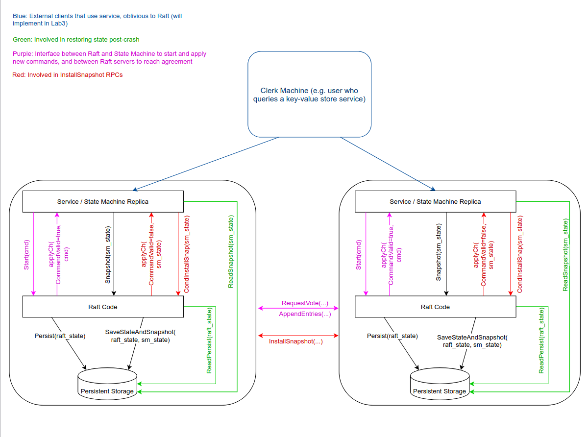

## : Key/value service without snapshots (moderate/hard)
- 要实现的3个RPC
    - Append(key, arg): appends arg to key's value (treating the existing value as an empty string if the key is non-existent)
    - Put(key, value): replaces the value for a particular key in the database
    - Get(key): fetches the current value of the key (returning the empty string for non-existent keys)
    neither Put nor Append should return a value to the client

- 修改kvraft/client.go, kvraft/server.go, and perhaps kvraft/common.go. 
- 您的 kvserver 不应直接通信；它们应仅通过 Raft 相互交互。  

简单说, 我们要建立的KV数据库是位于raft层之上的, 或者说我们的KV数据库使用了raft库。客户端（就是代码中的clerk）调用应用层(server)的RPC，应用层收到RPC之后，会调用Start函数，Start函数会立即返回，但是这时，应用层不会返回消息给客户端，因为它还没有执行客户端请求，它也不知道这个请求是否会被Raft层commit。只有在某一时刻，对应于这个客户端请求的消息在applyCh channel中出现, 应用层才会执行这个请求，并返回响应给客户端。
## 架构图

## 设计思路
### 为什么会线性不一致?
clerk和真正的客户端交互并管理RPC, 而server收到请求后需要将请求传递给raft层进行集群复制, 然后收到raft的commit, 在应用到状态机并返回给客户端。  

但问题在于需要确保以上操作的线性一致性， 那什么时候会出现线形不一致的情况呢？就是重复的请求。因为网络问题，clerk可能认为之前的请求丢包了， 所以会再次发送请求。而raft层是无法判断这个请求是否重复的, 如果server层没有特殊处理, 有的请可能在客户端看来只执行了一次, 但在server执行了多次, 并且如果这是Put等改变状态机的请求, 执行了多次将导致逻辑错误。

### 如何判断重复请求？
首先，server需要判断某一个请求是否重复，最简单的方法就是让clerk携带一个全局递增的序列号，并且server需要在第一次将这个请求应用到状态机时记录这个序列号, 用以判断后续的请求是否重复。由于clerk不是并发的, 所以server只需要记录某个clerk序列号最高的一个请求即可, 序列号更低的请求不会出现, 只需要考虑请求重复的场景。

### 如何处理重复请求？
除了记录某个clerk请求的序列号外， 还需要记录器执行结果，因为如果是一个重复的Get请求, 其返回的结果应该与其第一次发送请求时一致, 否则将导致线性不一致。如果是重复的Put等改变状态机的请求，就不应该被执行

- 总结下来, 思路就是:
    - 重复的Put/Append请求只在第一次出现时应用到状态机
    - 记录每次应用到状态机的请求结果和序列号

## 遇到的问题
~~~ sh
--- FAIL: TestSpeed4A (8.25s)
    test_test.go:424: Operations completed too slowly 75.577172ms/op > 33.333333ms/op
FAIL
~~~
原因是在lab4A中, kv数据库的命令要求命令能够尽快被commit, 且要求比一个心跳间隔更快, 但我在lab3的实现中, 无论是否调用了Start, 都不影响心跳的发送频率, 因此自然commit速度很慢, 过不了测试。因此需要修改lab3中Start, 使其立即唤醒一次心跳
- 我的做法是在ticker的select里面多一个case <-rf.timer.msgComing:，大小设为1，在Start()调用时非阻塞读入

## channel
当需要实现某种类型的锁或者信号量的时候，缓冲区为1的通道可以用来表示一个二元信号，比如控制同时只能有一个goroutine访问某个资源。比如，用通道来实现互斥锁，这时候缓冲区为1的通道可以被用来获取和释放“锁”，因为发送操作会放入一个元素，如果缓冲区已满则阻塞，这样其他goroutine就无法再发送，从而达到互斥的效果。