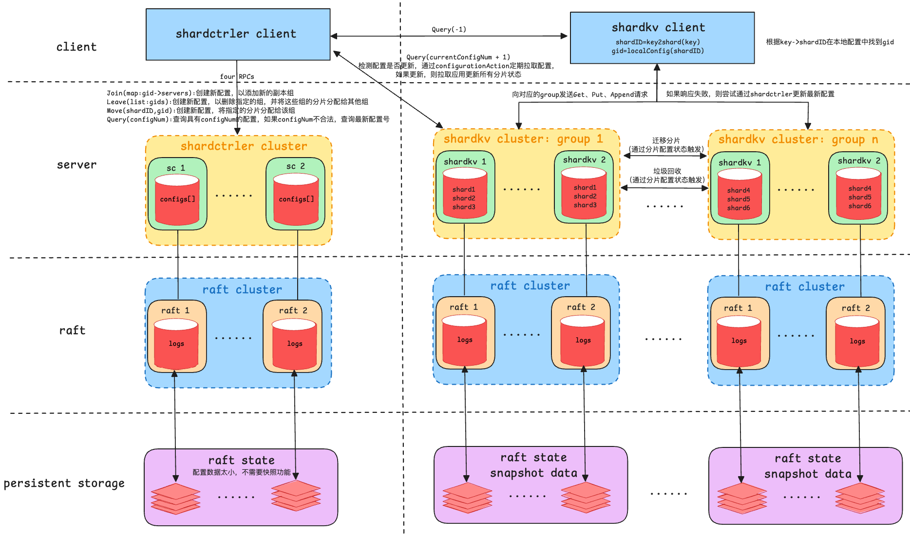

### lab5b
只有思路没干出来，我是傻逼
- 
Raft 在 KV 分布式存储系统中扮演着数据一致性和复制的角色。在分片（shard）管理的过程中，图中展示了每个分片（如 shard1, shard2 等）与对应的 Raft 集群进行绑定。
- 具体来说：
    - 一个 shardKV（分片 KV 存储） 对应 一个 Raft 集群。
    - 图中展示了一个 shardkv cluster: group 1，其中有多个 shardKV 节点（如 shard1、shard2），这些分片的数据由一个 Raft 集群（如 raft1、raft2）进行复制和一致性保障。
    - 每个 Raft 集群（如 raft1 和 raft2）管理和同步一个特定分片的数据。

因此，分片和 Raft 集群之间的关系是：一个 Raft 集群管理多个分片（shardKV）的数据一致性和日志复制，而不是一个 group 对应一个 Raft 集群。

### 一个ShardKV里面有什么
- 一个ShardKV是一个server，有一个gid,一个server有一个raft节点还有一个sc*shardctrler.Clerk 做为client与shardctrler进行交互，一个server里还有多个shard
~~~go
	gg.servers[i] = StartServer(ends, i, gg.saved[i], cfg.maxraftstate,
		gg.gid, mends,
		func(servername string) *labrpc.ClientEnd {
			name := randstring(20)
			end := cfg.net.MakeEnd(name)
			cfg.net.Connect(name, servername)
			cfg.net.Enable(name, true)
			return end
		})
    func StartServer(servers []*labrpc.ClientEnd, me int, persister *raft.Persister, maxraftstate int, gid int,
        ctrlers []*labrpc.ClientEnd, make_end func(string) *labrpc.ClientEnd) *ShardKV 
~~~
### 一个group是什么？
- 一个group里有多个server，所以一个group就是一个raft集群。而Join Leave是以group为单位的，在config里设置gid以及对应的server配置
- 以Join为例子，在加入完某些group后，会重新分配shardId->gid的配置，并且返回这个新的配置。（但是不会改变这个key对应的是哪个shard）
### 从Client的角度，我要Put(1,3)，我如何找到对应的shard,shardKV,group甚至raft节点
- 从客户端（Client）的角度，如果要执行 Put(1,3) 操作，过程通常包括以下几个步骤，用于确定对应的 shard, shardKV, group 以及 raft 节点：
    - 查询config：
        客户端首先会向 shardctrler 集群发送 Query(currentConfigNum + 1) 请求，这样可以获得当前的集群配置，其中包括各个 shardKV 的分片和分配信息（如哪个shard由哪个 shardKV 节点管理）。
        该请求会返回一个配置（**configs[]**），其中列出了每个 shardKV 节点及其管理的分片。

    - 查找目标分片：
        客户端通过查询配置来确定键 1 应该属于哪个分片（ **shard** ）。
        分片的划分通常是基于键值范围的，例如，可能会有规则将键 1 映射到 shard1。具体的映射规则可能依据分片算法（如一致性哈希、范围划分等）来确定。
        ~~~ go
        func key2shard(key string) int {
        	shard := 0
        	if len(key) > 0 {
        		shard = int(key[0])
        	}
        	shard %= shardctrler.NShards
        	return shard
        }
        ~~~
    - 确定目标 shardKV 节点：
        配置中会提供每个分片（如 shard1）对应的 shardKV 节点（如 shardkv1, shardkv2）。客户端查找包含 shard1 的 **shardKV** 节点。（目前一个group有一个shardKV,一个shardKV有多个shard）
        这个 shardKV 节点负责处理该分片的数据请求。

    - 确定目标 group：
        每个 shardKV 节点会归属于某个 shardkv cluster group，例如 shardkv cluster: group 1。客户端通过配置可以得知该 shardKV 节点属于哪个 group。
        例如，shardkv1 可能属于 group 1，而 shardkv2 可能属于 group 2，并且每个 group 内的节点共同管理其对应的分片。

    - 访问 Raft 集群：
        每个 shardKV 节点会有一个关联的 Raft 集群（如 raft1, raft2）。客户端通过 shardKV 的配置，可以获取到对应的 Raft 节点。
        客户端将请求发送到对应的 Raft 集群进行数据的一致性和持久化保证。

    - 执行 Put(1,3)：
        客户端找到目标 shardKV 节点后，向该节点发送 Put(1,3) 请求。这个请求会被 shardKV 节点路由到其关联的 Raft 集群，以保证数据的一致性。
        Raft 集群会处理日志复制，并最终将数据写入持久存储。
### 负载均衡
在分布式系统中，负载均衡是确保资源合理分配、提高系统性能和可扩展性的关键环节。对于一个基于分片的 KV 存储系统，负载均衡主要有以下几种策略：
1. 数据分片的均匀分布：
    - 目标：确保每个分片的数据量大致均匀，避免某些分片的数据过多，而其他分片的数据过少，导致某些 shardKV 节点负载过高。
    - 方法：哈希分片（Hash-based Sharding）：通过对键进行哈希运算，将数据均匀分配到不同的分片中。哈希函数的选择（如 key[0] % nShards）可以确保数据均匀分布到各个分片。
2. 分片控制器的动态调整：
    - 目标：当集群负载不均时，通过动态的分片迁移和重新分配来实现负载均衡。
    - 方法：
        - 分片迁移：当某个 shardKV 节点的负载过高时，可以将一些分片迁移到其他负载较低的节点。这要求系统能够动态地更新分片配置（shardctrler）。
        - 在线扩容和收缩：如果某些 shardKV 节点经常处于高负载状态，可以增加新的 shardKV 节点，并将一些分片从过载节点迁移到新的节点上，降低负载。类似地，当负载较低时，可以删除一些不需要的节点。
        - 负载均衡策略：shardctrler 会根据当前的负载情况，重新分配分片到不同的节点。通过周期性的检查系统负载，自动调整分片分配，保持负载均衡。

- 也就是说，目前的调度是以Shard为单位，可能在join或者leave后，每个group里面的shard个数不一样了，这是就动态的调整shard-> group，把shard移动到另一个group
